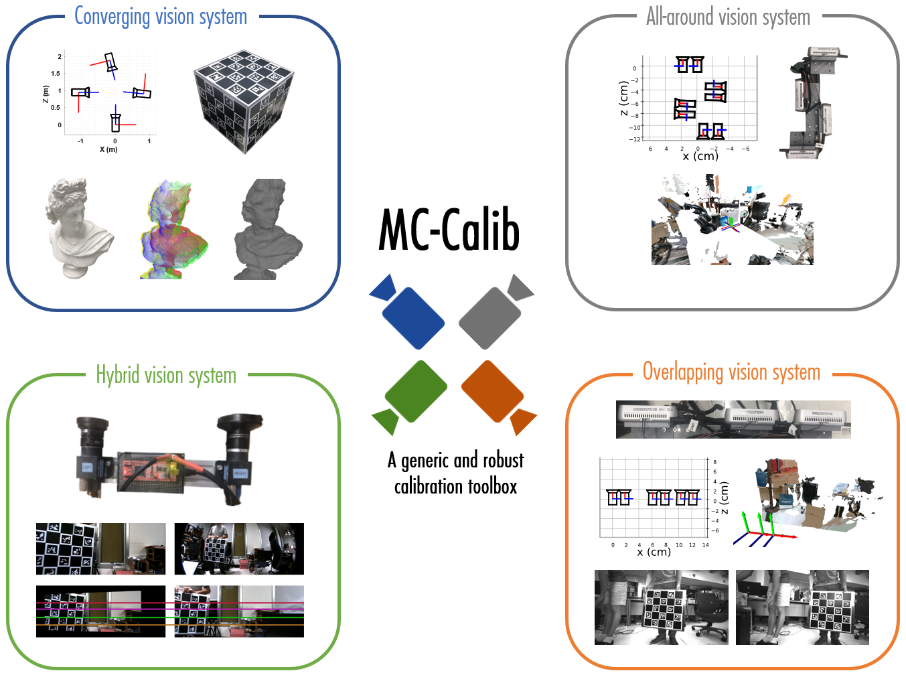

# MC-Calib

Toolbox described in the paper ["MC-Calib: A generic and robust calibration toolbox for multi-camera systems"](https://www.sciencedirect.com/science/article/abs/pii/S1077314221001818) ([RG](https://www.researchgate.net/publication/357801965_MC-Calib_A_generic_and_robust_calibration_toolbox_for_multi-camera_systems) for open access, [preprint](https://github.com/rameau-fr/MC-Calib/issues/4)).



# Installation

Requirements: Ceres, Boost, OpenCV {4.2.x, 4.5.x}, c++17 

For Windows users, follow [this installation guide](/docs/Windows.md)

There are several ways to get the environment ready. Choose any of them:

1. The easiest way to get the environment is to pull it from the Docker Hub:

   - [Install](https://docs.docker.com/engine/install/) docker.

   - Pull the image:

     ```bash
     docker pull bailool/mc-calib-prod # production environment
     docker pull bailool/mc-calib-dev  # development environment
     ```

   - Run pulled image:
   
      ```bash
      docker run \
                  -ti --rm \
                  --volume="${PWD}:/home/MC-Calib" \
                  --volume="PATH_TO_DATA:/home/MC-Calib/data" \
                  bailool/mc-calib-prod
      #xhost -local:root  # resetting permissions
      ```
      
2. It is also possible to build the docker environment manually (see [instructions](/docs/Docker.md))

3. Alternatively, every dependency can be installed independently without docker:

   - [Install](https://docs.opencv.org/4.5.2/d7/d9f/tutorial_linux_install.html) OpenCV 4.5.x. Either instal system-wide with `sudo make install` or link to your `build` in `CmakeLists.txt`.

   - Follow [installation guidelines](http://ceres-solver.org/installation.html#linux) to install Ceres.

   - Install boost:

      ```bash
      sudo apt install libboost-all-dev
      ```

Then the following should do the job of compiling the code inside the `MC-Calib` root:

   ```bash
   mkdir build
   cd build
   cmake -DCMAKE_BUILD_TYPE=Release ..
   make -j10  
   ```

Documentation is available [online](https://codedocs.xyz/rameau-fr/MC-Calib/). To generate local documentation, follow [the instructions](/docs/Documentation.md).
      
# Usage

## Calibration procedure

1. **Generate your own Charuco boards**

      If all your boards are similar (same number of squares in the x and y directions), you only need to specify the `number_x_square`, `number_y_square`, and `number_board`. Then you can run the Charuco board generator:
      ```bash
      ./apps/create_charuco_boards/generate_charuco ../configs/calib_param.yml
      ```
      If each board has a specific format (different number of squares), then you need to specify it in the fields 		`number_x_square_per_board` and `number_y_square_per_board`. For instance, if you want to use two boards of size [10x3] and [5x4] respectively, you have to set:
      ```
      number_board: 2 
      number_x_square_per_board: [10,5]
      number_y_square_per_board: [3,4]
      ```
      A sample of Charuco boards is provided in [board_samples](docs/board_samples).
      Note: the board images are saved to the root folder where the code is executed.

2. **Print your boards**

3. **Measure the size of the squares on your boards**

      If the boards have all the same square size, you just need to specify it in `square_size` and leave `square_size_per_board` empty. If each board has a different size, specify it in `square_size_per_board`. For instance, `square_size_per_board: [1, 25]` means that the first and second boards are composed of square of size `0.1cm` and `0.25cm` respectively. Note that the square size can be in any unit you prefer (m, cm, inch, etc.) and the resulting calibration will also be expressed in this unit.

4. **Acquire your images**

      MC-Calib has been designed for synchronized cameras, therefore, you have to make sure that all the cameras in the rig capture images at the exact same time. Additionally, this toolbox has been designed and tested for global shutter cameras, therefore we cannot guarantee highly accurate results if you are using rolling shutter sensors. For high-quality calibration, make sure to have a limited quantity of motion blur during your sequence.

5. **Prepare your video sequences**

      The images extracted from each camera have to be stored in different folders with a common prefix followed by a three digits index (starting from 001). For instance, if two cameras are used, the folder can be called: 'Cam_001' and 'Cam_002'. 

6. **Setup the configuration file for your system**

	* *Set the number of cameras and cameras' types:*

      The number of cameras to be calibrated have to be specified in the field `number_camera`.
      If you are calibrating a homogeneous camera system you can specify the camera type with `distortion_model`: `0` signifies that all your cameras are perspective (Brown distortion model) and a `1` will use the Kannala distortion model (fisheye).
      If you are calibrating a hybrid vision system (composed of both fisheye and perspective cameras), you need to specify the type of distortion model you wish to use in the vector `distortion_per_camera`.

	* *Set the image path:*

      You need to specify the folder where the images have been stored in the field `root_path` for instance `"../Data/Image_folder/"`.

	* *Set the outputs:*

      By default, MC-Calib will generate the camera calibration results, the reprojection error log, the 3D object structure, detected keypoints, and the pose of the object for each frame where it has been detected. Additionally, you can save the detection and reprojection images by setting `save_detection` and `save_reprojection` to `1`.

	* *Using only certain boards:*

      If you prepared a large number of calibration objects but only a few appear in your calibration sequence, you can specify the list of boards' indexes in `boards_index`. Specifying the board indexes avoids trying to detect all the boards and will speed up your calibration.

	* *Advanced setup:*

      For a general calibration setup, for the sake of robustness, we recommend setting `min_perc_pts` to at least 0.4 (40% of the points of the board should appear to be considered). However, in the case of calibration of limited field-of-view overlapping with a single board, this parameter can be reduced significantly. Our automatic colinear points check should avoid most degenerated configurations.
      The provided example configuration files contain a few additional parameters which can be tuned. Letting these parameters by default should lead to a correct calibration of your system, but you can adjust them if needed. These parameters are quite self explicit and described in the configuration files.

7. **Run the calibration**

	```bash
	./apps/calibrate/calibrate ../configs/calib_param.yml
	```

## Calibration file

For multiple camera calibration configuration examples see `configs/*.yml`.  For easier start, just duplicate the most relevant setup and fill with details.

```bash
######################################## Boards Parameters ###################################################
number_x_square: 5         # number of squares in the X direction
number_y_square: 5         # number of squares the Y direction
resolution_x: 500          # horizontal resolution in pixel
resolution_y: 500          # vertical resolution in pixel
length_square: 0.04        # parameters on the marker (can be kept as it is)
length_marker: 0.03        # parameters on the marker (can be kept as it is)
number_board: 3            # number of boards used for calibration (for overlapping camera 1 is enough ...)
boards_index: []           # leave it empty [] if the board index are ranging from zero to number_board; example of usage boards_index: [5,10 <-- only two board with index 5/10
square_size: 0.192         # size of each square of the board in cm/mm/whatever you want

############# Boards Parameters for different board size (leave empty if all boards have the same size) #################
number_x_square_per_board: []
number_y_square_per_board: []
square_size_per_board: []

######################################## Camera Parameters ###################################################
distortion_model: 0         # 0:Brown (perspective) // 1: Kannala (fisheye)
distortion_per_camera : []  # specify the model per camera, #leave "distortion_per_camera" empty [] if they all follow the same model (make sure that the vector is as long as cameras nb)
number_camera: 2            # number of cameras in the rig to calibrate
refine_corner: 1            # activate or deactivate the corner refinement
min_perc_pts: 0.5           # min percentage of points visible to assume a good detection

cam_params_path: "None"     # file with cameras intrinsics to initialize the intrinsic, write "None" if no initialization available 

######################################## Images Parameters ###################################################
root_path: "../data/Synthetic_calibration_image/Scenario_1/Images/"
cam_prefix: "Cam_"
keypoints_path: "None"      # "path_to/detected_keypoints_data.yml" to save time on keypoint detection

######################################## Optimization Parameters #############################################
quaternion_averaging: 1     # use Quaternion Averaging or median for average rotation
ransac_threshold: 10        # RANSAC threshold in pixel (keep it high just to remove strong outliers)
number_iterations: 1000     # Max number of iterations for the non linear refinement

######################################## Hand-eye method #############################################
he_approach: 0              #0: bootstrapped he technique, 1: traditional he

######################################## Output Parameters ###################################################
save_path: "experiments/Synthetic_calibration_image/Scenario_1/"
save_detection: 1
save_reprojection: 1
camera_params_file_name: "" # "name.yml"
```

## Output explanation

The calibration toolbox automatically outputs four ```*.yml``` files. To illustrate them, we propose to display the results obtained from the calibration of a hybrid stereo-vision system.

* **Camera parameters:** `calibrated_cameras_data.yml`

   ```bash
   %YAML:1.0
   ---
   nb_camera: 2 
   camera_0: # all the calibration parameters (intrinsic/extrinsic) for the camera 0
      camera_matrix: !!opencv-matrix # 3x3 intrinsic matrix
         rows: 3
         cols: 3
         dt: d
         data: [ 6.9057886528642052e+02, 0., 6.5114341701043156e+02, 0.,
            6.8919862105007201e+02, 2.6741231181725999e+02, 0., 0., 1. ]
      distortion_vector: !!opencv-matrix # 1x5 distortion vector (Brown model here)
         rows: 1
         cols: 5
         dt: d
         data: [ -5.5592652556282401e-02, 1.2691061778374907e-01,
            -2.4976766901851363e-04, 1.1847248726536302e-03,
            -6.7785776099559991e-02 ]
      distortion_type: 0 # type of distortion model (0: perspective, 1: fisheye)
      camera_group: 0 #Camera group in which this camera belong, if the calibration has been sucessful, all camera should belong to the group 0
      img_width: 1280 #image size
      img_height: 512
      camera_pose_matrix: !!opencv-matrix
         rows: 4
         cols: 4
         dt: d
         data: [ 1., 0., 0., 0., 0., 1., 0., 0., 0., 0., 1., 0., 0., 0., 0.,
            1. ] #4x4 extrinsic matrix (for camera 0, it is the identity because it is the reference)
   camera_1: # all the calibration parameters (intrinsic/extrinsic) for the camera 1
      camera_matrix: !!opencv-matrix # 3x3 intrinsic matrix for camera 1
         rows: 3
         cols: 3
         dt: d
         data: [ 3.3467577884661034e+02, 0., 6.3270889699552083e+02, 0.,
            3.3407723815119016e+02, 2.6650518594457941e+02, 0., 0., 1. ]
      distortion_vector: !!opencv-matrix # 1x4 distortion vector (fisheye model)
         rows: 1
         cols: 4
         dt: d
         data: [ 1.1763357579105141e-02, -5.1797112353852174e-03,
            2.6315580610037459e-03, 0. ]
      distortion_type: 1 # type of distortion model (0: perspective, 1: fisheye)
      camera_group: 0
      img_width: 1280
      img_height: 512
      camera_pose_matrix: !!opencv-matrix #4x4 extrinsic matrix
         rows: 4
         cols: 4
         dt: d
         data: [ 9.9999074801577947e-01, 7.7896180494682642e-04,
            -4.2304965841050025e-03, 1.9839157514973714e+01,
            -7.9020195036245652e-04, 9.9999616084980592e-01,
            -2.6559116188004227e-03, 6.1882118248103253e-02,
            4.2284114888848610e-03, 2.6592299929997965e-03,
            9.9998752443824268e-01, 1.8600285922272908e+00, 0., 0., 0., 1. ]  #4x4 extrinsic matrix, expressed in camera 0 referencial
   ```

* **Object 3D structure:** `calibrated_objects_data.yml`

   ```bash
   %YAML:1.0
   ---
   object_0: #object index (if all boards have been seen, a single object should exist)
      points: !!opencv-matrix #3xn 3D structure of the object
         rows: 3
         cols: 16
         dt: f
         data: [ 0., 9.14999962e+00, 1.82999992e+01, 2.74499989e+01, 0.,
            9.14999962e+00, 1.82999992e+01, 2.74499989e+01, 0.,
            9.14999962e+00, 1.82999992e+01, 2.74499989e+01, 0.,
            9.14999962e+00, 1.82999992e+01, 2.74499989e+01, 0., 0., 0., 0.,
            9.14999962e+00, 9.14999962e+00, 9.14999962e+00, 9.14999962e+00,
            1.82999992e+01, 1.82999992e+01, 1.82999992e+01, 1.82999992e+01,
            2.74499989e+01, 2.74499989e+01, 2.74499989e+01, 2.74499989e+01,
            0., 0., 0., 0., 0., 0., 0., 0., 0., 0., 0., 0., 0., 0., 0., 0. ]
   ```

* **Object's poses:** `calibrated_objects_pose_data.yml`

   The pose of the object (for all frames where boards are visible) with respect to the reference camera is provided in this file as a 6xn array. Each row contains the Rodrigues angle-axis (3 floats) followed by the translation vector (3 floats).

* **Reprojection error log:** `reprojection_error_data.yml`

   The reprojection error for each corner, camera and frame.

   Samples of python code to read these files are provided in ```python_utils```

# Datasets
The synthetic and real datasets acquired for this paper are freely available via the following links:
- [Real Data](https://drive.google.com/file/d/143jdSi5fxUGj1iEGbTIQPfSqcOyuW-MR/view?usp=sharing)
- [Synthetic Data](https://drive.google.com/file/d/1CxaXUbO4E9WmaVrYy5aMeRLKmrFB_ARl/view?usp=sharing)


# Contribution

Please follow `docs/contributing.rst` when introducing changes. 

# Citation

If you use this project in your research, please cite:
```
@article{RAMEAU2022103353,
title = {MC-Calib: A generic and robust calibration toolbox for multi-camera systems},
journal = {Computer Vision and Image Understanding},
pages = {103353},
year = {2022},
issn = {1077-3142},
doi = {https://doi.org/10.1016/j.cviu.2021.103353},
url = {https://www.sciencedirect.com/science/article/pii/S1077314221001818},
author = {Francois Rameau and Jinsun Park and Oleksandr Bailo and In So Kweon},
keywords = {Camera calibration, Multi-camera system},
}
```


